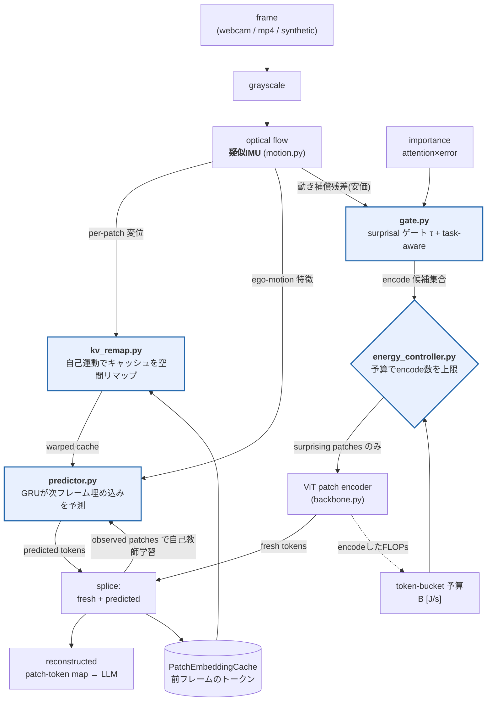

# Saccade 👁️⚡

**予測誤差ゲート＋エネルギー予算制御による、常時オンのエッジVLM.**
*Predict what the next frame will look like; spend compute only where you were wrong; never exceed your energy budget.*

Saccade は、頭が動いても世界の見えは滑らかに予測できる — という生物の視覚（サッカード間の予測）にならい、
**「予測できたパッチは再エンコードしない」** ことでエッジ常時稼働VLMの消費電力を削ります。
鍵は *自己運動 (ego-motion) の補償*：カメラが動くと画素はほぼ全て変化するが、**動きを差し引けば静止世界の残差はほぼゼロ**。
既存の「フレーム類似度で間引く」手法が定常運動を全く間引けないのに対し、Saccade は大きく間引けます。

---

## TL;DR（合成歩行ストリーム, CPU, ViT-S/16 相当）

| 手法 | 再エンコード% | 品質 (fidelity vs Full) | 推定エネルギー(J) | 平均電力 | **10kJでの連続稼働** |
|---|---|---|---|---|---|
| **(A) Full**（毎フレーム全エンコード） | 100.0 | 1.000 | 1.264 | 91.6 mW | 30.3 h |
| **(B) TemporalSim**（同位置フレーム差分で間引く） | 33.9 | 0.972 | 0.430 | 31.2 mW | 89.1 h |
| **(C) Saccade**（予測誤差ゲート＋IMU補償＋予算制御） | **20.6** | **0.971** | **0.262** | **19.0 mW** | **146.4 h** |

- **省エネ**: Full 比 **4.8×**、TemporalSim 比 **1.65×** 少ない計算で、
- **品質保持**: 品質は TemporalSim と同等（Full に対する fidelity 0.971 ≈ 0.972）、
- **予算保証**: 予算制御ON時の予算超過は **0 件**（0.05 W〜0.0001 W の全設定で厳密不変条件を満たす）。

> 数値は `benchmarks/results.json` に保存。エネルギーは解析的FLOPモデル×`1 pJ/FLOP`（効率的なモバイル推論の目安、`--j-per-flop` で変更可）。

---

## 目玉の図：なぜ temporal-similarity は定常運動を間引けないか


歩行区間の連続2フレーム。カメラがパンしただけで**世界は静止**しているのに、
- **左下 (B の判定信号)**：*同位置*の残差はほぼ全面で高い → **36% を再エンコード**。
- **右下 (C の判定信号)**：*自己運動補償後*の残差はほぼゼロ → **0% を再エンコード**。

これが Saccade の核心です。「変わったか？」ではなく「**動きで説明できない変化があったか？**」を問う。

### フレーム毎の負荷（目玉）


`walk`/`turn`（予測可能な自己運動）区間で **B は 42–64% を再エンコードし続ける** のに対し、**C は ~14% に間引ける**。
`static`（静止）と `event`（独立に動く物体＝真の変化）区間では両者ほぼ同じ — つまり C は**真の変化はきちんと拾う**（ずるをしていない）。

### 品質 / エネルギーのトレードオフ


Saccade は予算Bを変えるだけで Pareto 前線を掃引でき、TemporalSim の単一動作点を**支配**します（同品質でより低エネルギー、または同エネルギーでより高品質）。

### webcam風デモ（B vs C, 赤=そのフレームで再エンコードしたパッチ）


---

## アーキテクチャ



*4つのコア（青）*：`predictor`（前方予測）・`gate`（surprisal ゲート）・`kv_remap`（動き補償再利用）・`energy_controller`（予算制御）。
`engine.py` がこれらを毎フレーム統合し、`full` / `temporalsim` / `saccade` の3条件を**同一エンジン**で生成します（公平比較のため差分は機構のみ）。

---

## 主張 → コードの対応（各関数 docstring に「どの主張を実証するか」を明記）

| 主張 | 実証する場所 |
|---|---|
| **省エネ** (energy saving) | `gate.py`（surprising な少数だけ encode）, `kv_remap.py`（動き補償で再計算削減）, `flops.py`（FLOP→J は encode 数に単調） |
| **品質保持** (quality preservation) | `predictor.py`（未encodeパッチの値を予測）, `engine.py` の fidelity（再構成 vs Full のコサイン類似）, gate の task-aware/forced |
| **予算保証** (budget guarantee) | `energy_controller.py`（token bucket で `cum_J ≤ B·t + E0` を構成的に保証, 枯渇時は frame-drop で anytime 劣化出力） |

---

## 4つのコア（詳細）

1. **PatchEmbeddingCache ＋ 前方予測器** — `predictor.py`, `engine.py`
   各パッチ埋め込みをキャッシュ。極小GRU（重み全パッチ共有）が
   *動き補償済みキャッシュ ＋ 疑似IMU* から次フレーム各パッチ埋め込みを予測。
   **完全自己教師あり**：実際に encode した（＝gateが通した）パッチの真値で `||pred−true||` をオンライン学習。ラベル不要。
   予測は「warpedキャッシュ上の残差」を出すので、初期は恒等（残差0）から学習が進む。

2. **Surprisal ゲート** — `gate.py`
   パッチ毎に *動き補償後の見えの残差*（画素空間の安価な proxy）を閾値 τ で判定し、超えたパッチだけ再エンコード、他はキャッシュKVを再利用。
   *タスク認識版*：`importance = EMA(直近の埋め込みsurprisal)`（LLM注意が無いCPU設定での「注意×誤差」代替）で `τ_eff = τ/(1+λ·w)` とし、重要パッチの閾値を下げる。
   （鶏卵問題：真の埋め込みsurprisalは encode 後にしか分からないため、判定は安価な proxy、学習・importance更新は encode 済みパッチの真値で行う — docstring 参照。）

3. **モーション補償KV再利用** — `kv_remap.py`
   疑似IMU変位でキャッシュ済みトークンを新しい空間位置へ双線形リマップしてから再利用（位置ずれによる無駄な再計算を回避）。フレーム端の新出領域は invalid として強制 encode。
   **効果（実測）**：動き補償ONで総再計算パッチ数が **~3.3×** 減。

4. **エネルギー予算コントローラ** — `energy_controller.py`
   簡易エネルギーモデル `J = (encoder+prefill FLOPs) × [J/FLOP]`。予算 `B [J/s]` に対し
   **(1) ソフトループ**：比例制御で τ を調整し平均電力を B に追従（予算いっぱいまで使い切り効用最大化）。
   **(2) ハードキャップ**：token bucket（容量 `E0 = reserve·B`, 毎フレーム `B/fps` 補充）が
   `任意の t で 累積エネルギー ≤ B·t + E0` を**構成的に保証**。bucket が枯れたフレームは丸ごと drop し、
   直前キャッシュを **anytime の劣化出力** として返す（必ず有効出力）。

---

## クイックスタート

```bash
pip install -r requirements.txt

# ベンチ（合成歩行ストリーム, 図とGIFとresults.jsonを生成）
python benchmarks/run.py

# 予算を変える / fpsを変える
python benchmarks/run.py --budget 0.01 --fps 15

# 実webcam or mp4 で
python benchmarks/run.py --source webcam
python benchmarks/run.py --source path/to/walk.mp4

# 実ViT/DINOv2 のパッチトークンで（要 transformers）
python benchmarks/run.py --backbone hf:facebook/dinov2-small

# テスト（予測ゲートON時の品質・予算超過なし・動き補償で再計算減 を検証）
pytest -q
```

### 小型VLMのラッパー
`saccade/backbone.py` は ViT系ビジョンエンコーダの**パッチ埋め込み**に介入する薄いラッパーを提供します：

- `SyntheticBackbone` — 依存なし・決定的・**部分パッチ encode が本当に可能**（frozen random ViT-S/16 相当）。テストと再現ベンチの既定。
- `HFVisionBackbone` — 実 HuggingFace ViT/DINOv2（`facebook/dinov2-small` 等）のパッチトークンを露出。self-attentionのため部分encodeは*会計上*の近似（token-caching近似, `flops.py` 参照）。
  **検証済み**：`facebook/dinov2-small`（grid 16×16, D=384）で全パイプラインが動作（44フレーム短尺ストリーム、実測値: [benchmarks/results_dinov2.json](benchmarks/results_dinov2.json)）。実DINOv2特徴でも予算スイープが品質/エネルギーの Pareto を掃引し、TemporalSim の動作点（0.130 J, fidelity 0.834）に対し **Saccade@0.05 W は 0.149 J で fidelity 0.900**（同エネルギー帯で +0.066）、@0.1 W は 0.303 J / 0.971（Full 0.464 J 比 35% 減で品質 97%）。予算違反は全設定で 0。
  注意点も実測どおり記す：実特徴は self-attention で文脈が混ざるため、キャッシュ再利用の誤差が合成encoderより大きく、**低予算側の品質劣化は速い**（0.065 J → fidelity 0.719）。意味的特徴での低予算運用は今後の改善対象。
  moondream2 / SmolVLM 等のVLMビジョンタワーも同API（パッチトークン露出）で差し替え可能な設計。

> **なぜ既定が合成？** アルゴリズム（予測ゲート/動き補償/予算制御）はバックボーン非依存です。合成encoderは各パッチが独立関数なので**部分encodeが実計算削減として実現**し、省エネ主張が近似なしで測れます。実ViTでは同じ機構が実特徴の上で動く様子を確認できます（品質保持の確認向き）。

---

## リポジトリ構成

```
saccade/
  backbone.py          # ViTパッチ埋め込みラッパー（synthetic / HF）
  motion.py            # 光学フロー = 疑似IMU（per-patch変位 + ego-motion特徴）
  predictor.py         # 前方予測器（共有重みGRU, オンライン自己教師あり）
  kv_remap.py          # 動き補償によるキャッシュ空間リマップ
  gate.py              # surprisal ゲート（proxy判定 + task-aware + importance）
  energy_controller.py # token-bucket 予算制御（比例τ + anytime frame-drop）
  engine.py            # 4コアを統合する常時オンループ + full/temporalsim/saccade
  flops.py             # 解析的FLOP/エネルギーモデル
  stream.py            # フレーム源（合成歩行 / webcam / mp4）
  types.py             # EngineConfig / FrameResult / RunSummary
benchmarks/
  run.py               # A/B/C比較・図・GIF・results.json
  results.json         # 最新の測定値
figures/               # 生成物（PNG + demo GIF）
tests/                 # pytest（省エネ/品質保持/予算保証 を検証）
```

---

## 設計上の正直な注記 (honest caveats)

- **エネルギーは解析モデル**：実測 J ではなく `FLOPs × [J/FLOP]` の推定。相対比較（A/B/C）と予算保証の論理は正しく、絶対値は係数依存。`--j-per-flop` で係数変更可。
- **token-caching 近似**：実ViTでは各パッチトークンが自己注意で混ざるため、部分encodeの節約は「そのトークンだけ再計算し他はキャッシュ再利用」という近似で会計。実HWでの実現には block-sparse attention が要る（本プロトタイプは*判定品質*と*モデル化エネルギー*を測る）。合成バックボーンは節約を実計算として実現。
- **合成ストリーム**：既定入力は決定的な合成「歩行」映像（明示的にラベル）。定常運動regimeを制御して再現可能に評価するため。実webcam/mp4も同一パイプラインで動作。
- **サーバ側長尺QAに非依存**：V-Rex/StreamingTOM 系の長尺動画QAには依存・模倣していません。エッジ常時オン設定に集中。
- **量子化/NPUは後回し**：まずCPU＋小型モデルで正しく動くことを最優先（本README/テストは全てCPUで再現）。

---

## ライセンス
MIT — [LICENSE](LICENSE) 参照。研究プロトタイプです。
