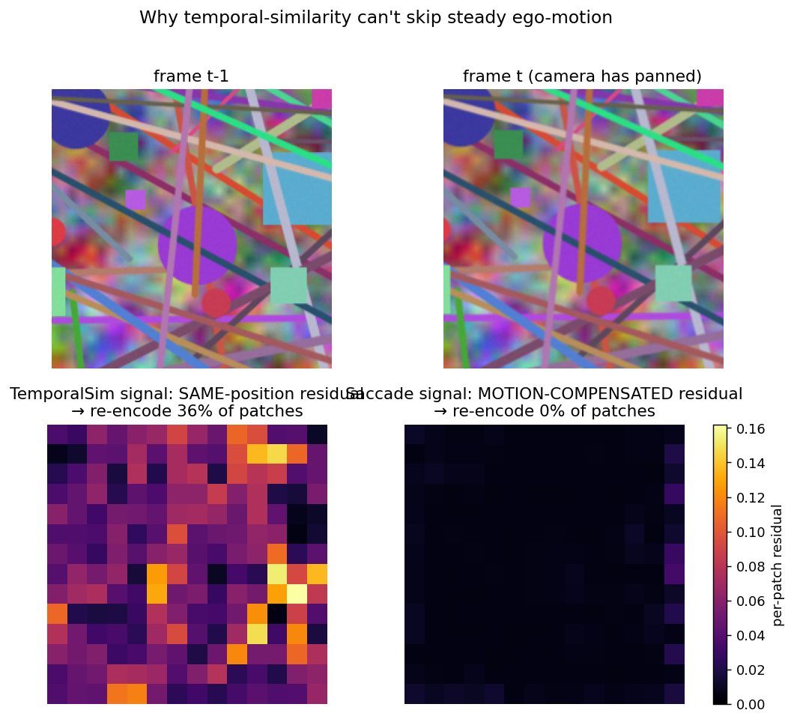
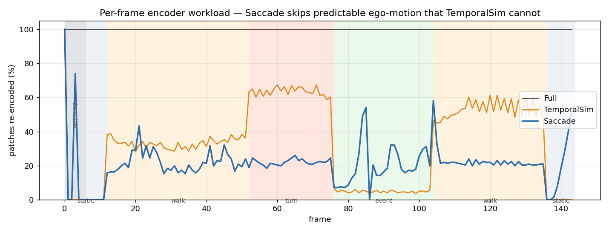
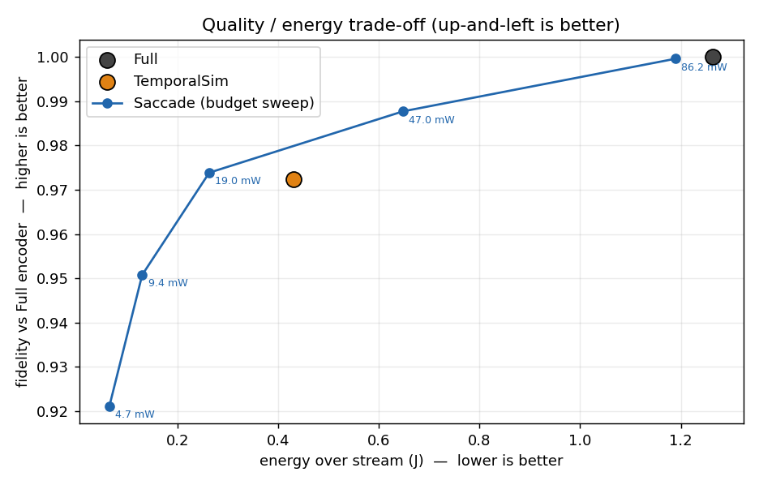
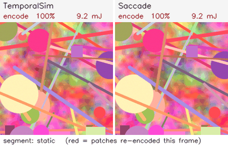
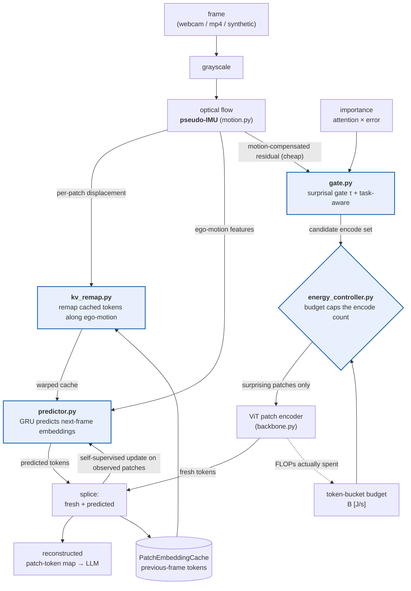

# Saccade 👁️⚡

[](https://github.com/NagaYu/saccade/actions/workflows/ci.yml)
[](LICENSE)
[](pyproject.toml)
[](https://github.com/NagaYu/saccade/releases)

[](https://huggingface.co/spaces/NagaYu/saccade)
[](https://huggingface.co/NagaYu/saccade-predictor)
[](https://huggingface.co/datasets/NagaYu/saccade-egomotion-bench)

**An always-on edge VLM driven by prediction-error gating and an energy budget.**
*Predict what the next frame will look like; spend compute only where you were wrong; never exceed your energy budget.*

Saccade borrows a trick from biological vision — the world stays smoothly predictable while your head moves — and cuts the power draw of an always-on edge VLM by **never re-encoding a patch it could predict**. The key is *ego-motion compensation*: when the camera moves, almost every pixel changes, but **subtract the motion and the residual of a static world is nearly zero**. Existing "frame-similarity" skipping cannot skip steady motion at all; Saccade skips most of it.

---

## TL;DR (synthetic walking stream, CPU, ViT-S/16-class encoder)

| Method | Patches re-encoded | Fidelity vs Full | Estimated energy (J) | Mean power | **Runtime on 10 kJ** |
|---|---|---|---|---|---|
| **(A) Full** (encode everything, every frame) | 100.0% | 1.000 | 1.264 | 91.6 mW | 30.3 h |
| **(B) TemporalSim** (same-position frame-diff skipping) | 33.9% | 0.9723 | 0.430 | 31.2 mW | 89.1 h |
| **(C) Saccade** (prediction-error gate + IMU compensation + budget control) | **20.7%** | **0.9739** | **0.263** | **19.1 mW** | **145.8 h** |

- **Energy saving**: 4.8× less compute than Full and 1.65× less than TemporalSim,
- **Quality preservation**: *higher* fidelity than TemporalSim (0.9739 vs 0.9723) while spending 39% less energy — better on both axes,
- **Budget guarantee**: zero budget violations with the controller on (the strict invariant holds for every budget from 0.05 W down to 0.0001 W).

> **Try it in your browser: [🤗 interactive demo](https://huggingface.co/spaces/NagaYu/saccade)** — sweep τ and the energy budget, or switch motion compensation off and watch the advantage disappear.

> Numbers are stored in `benchmarks/results.json`. Energy comes from an analytic FLOP model × `1 pJ/FLOP` (a reasonable figure for efficient mobile inference; change it with `--j-per-flop`).

---

## The centerpiece figure: why temporal similarity can't skip steady motion



Two consecutive frames from the walking segment. The camera has merely panned — **the world is static** — yet:
- **Bottom-left (B's decision signal)**: the *same-position* residual is high almost everywhere → **re-encode 36% of patches**.
- **Bottom-right (C's decision signal)**: the *motion-compensated* residual is near zero → **re-encode 0% of patches**.

This is the heart of Saccade: don't ask "did the pixels change?" — ask "**did anything change that motion cannot explain?**"

### Per-frame encoder workload


During `walk`/`turn` (predictable ego-motion) segments, **B is stuck re-encoding 42–64%** while **C thins the load to ~14%**. On `static` (no motion) and `event` (an independently moving object = genuine change) segments the two behave almost identically — i.e. C **still catches real change** (no cheating).

### Quality / energy trade-off


Just by varying the budget B, Saccade sweeps a Pareto frontier that **dominates** TemporalSim's single operating point (same quality at lower energy, or higher quality at the same energy).

### Webcam-style demo (B vs C; red = patches re-encoded this frame)


---

## Architecture



*The four cores (blue)*: `predictor` (forward prediction), `gate` (surprisal gating), `kv_remap` (motion-compensated reuse), `energy_controller` (budget control).
`engine.py` integrates them every frame and produces all three conditions — `full` / `temporalsim` / `saccade` — from **one engine**, so the comparison differs only in the mechanism under test.

---

## Claims → code (every function's docstring states which claim it demonstrates)

Docstrings tag claims with their Japanese research labels: 省エネ = energy saving, 品質保持 = quality preservation, 予算保証 = budget guarantee.

| Claim | Where it is demonstrated |
|---|---|
| **Energy saving** | `gate.py` (encode only the surprising few), `kv_remap.py` (motion compensation cuts recomputation), `flops.py` (FLOP→J is monotone in encode count) |
| **Quality preservation** | `predictor.py` (predicts values for un-encoded patches), fidelity in `engine.py` (cosine of reconstruction vs Full), the gate's task-aware/forced paths |
| **Budget guarantee** | `energy_controller.py` (token bucket enforces `cum_J ≤ B·t + E0` by construction; on starvation, frame-drop yields an anytime degraded output) |

---

## The four cores in detail

1. **PatchEmbeddingCache + forward predictor** — `predictor.py`, `engine.py`
   Every patch embedding is cached. A tiny GRU (weights shared across patches) predicts each patch's next-frame embedding from the *motion-compensated cache + pseudo-IMU + the gate's cheap residual*.
   **Fully self-supervised**: it trains online on `||pred − true||` using the true embeddings of patches the gate chose to encode anyway. No labels.
   The prediction is a *residual on top of the warped cache*, so learning starts from identity (residual 0) and only has to model what ego-motion cannot explain.

   ⚠️ **A finding worth stating plainly.** A naive version of this predictor *made things worse* — fidelity decreased monotonically with learning rate, and pure motion-warped reuse beat it. The cause is a train/apply distribution mismatch: ground truth only exists for patches the gate chose to **encode** (the surprising ones), but the prediction is applied to the ones it **skipped** (the unsurprising ones). A correction fitted on the former is simply wrong for the latter. Two mechanisms fix it:
   - the gate's per-patch residual is fed in as a **feature**, so the network can tell which regime a patch is in;
   - a **trust scalar** `∈ [0,1]` gates how much of the correction is applied, raised or lowered by a counterfactual check ("would the full residual have beaten doing nothing?") measured on a handful of randomly **explored** patches drawn from the skipped population (`explore_frac`, ~1% of patches — a real energy cost, counted honestly in `n_encoded`).

   The result is a predictor that **cannot backfire**: trust decays toward 0 where the warp is already near-exact (the synthetic backbone: +0.0007) and rises where the warp is lossy (real DINOv2 tokens: **+0.0147**). Its value is precisely proportional to how imperfect motion compensation is — which, once you see it, is the only shape the result could have had.

2. **Surprisal gate** — `gate.py`
   Per patch, threshold the *motion-compensated appearance residual* (a cheap pixel-space proxy) at τ; re-encode only patches above it, reuse cached KV for the rest.
   *Task-aware variant*: `importance = EMA(recent embedding surprisal)` (a stand-in for "attention × error" in this CPU setting without LLM attention) corrects the threshold as `τ_eff = τ/(1+λ·w)`, lowering the bar for important patches.
   (Chicken-and-egg: true embedding surprisal is only known *after* encoding, so decisions use the cheap proxy while learning/importance updates use the true values of encoded patches — see the docstrings.)

3. **Motion-compensated KV reuse** — `kv_remap.py`
   Bilinearly remap cached tokens to their new spatial positions along the pseudo-IMU displacement *before* reuse (avoiding wasted recomputation from positional misalignment). Newly revealed patches at the frame edge are invalid and force-encoded.
   **Measured effect**: motion compensation cuts total recomputed patches by **~3.3×**.

4. **Energy budget controller** — `energy_controller.py`
   Simple energy model: `J = (encoder + LLM-prefill FLOPs) × [J/FLOP]`. Given a budget `B [J/s]`:
   **(1) soft loop** — proportional control adapts τ so average power tracks B (spend the budget you have; maximize utility);
   **(2) hard cap** — a token bucket (capacity `E0 = reserve·B`, refill `B/fps` per frame) enforces
   `cumulative energy ≤ B·t + E0` for all t **by construction**. When the bucket runs dry the frame is dropped entirely and the previous cache is returned as an **anytime degraded output** (there is always a valid output).

---

## Quick start

```bash
pip install -r requirements.txt

# benchmark (synthetic walking stream; writes figures, the GIF, and results.json)
python benchmarks/run.py

# change the budget / fps
python benchmarks/run.py --budget 0.01 --fps 15

# run on a real webcam or an mp4
python benchmarks/run.py --source webcam
python benchmarks/run.py --source path/to/walk.mp4

# run on real ViT/DINOv2 patch tokens (requires transformers)
python benchmarks/run.py --backbone hf:facebook/dinov2-small

# tests (gate-on quality, zero budget violations, motion comp reduces recompute)
pytest -q
```

### The small-VLM wrapper
`saccade/backbone.py` provides a thin wrapper that intervenes at the **patch embeddings** of a ViT-class vision encoder:

- `SyntheticBackbone` — dependency-free, deterministic, and **genuinely capable of encoding a subset of patches** (a frozen-random ViT-S/16 stand-in). Default for tests and the reproducible benchmark.
- `HFVisionBackbone` — exposes the patch tokens of a real HuggingFace ViT/DINOv2 (e.g. `facebook/dinov2-small`). Because of self-attention, subset encoding is an *accounting* approximation (token-caching; see `flops.py`).
  **Verified**: the full pipeline runs end-to-end on `facebook/dinov2-small` (grid 16×16, D=384;
  44-frame short stream; measurements in [benchmarks/results_dinov2.json](benchmarks/results_dinov2.json)).
  On real DINOv2 features Saccade **beats TemporalSim on both axes at once**: fidelity 0.837 vs
  0.834 while spending **half the energy** (0.065 J vs 0.130 J, i.e. 14.0% vs 27.9% of patches
  re-encoded). The budget sweep traces the full frontier — 0.638 @ 4.8 mW, 0.837 @ 17.2 mW,
  0.907 @ 39.3 mW, 0.972 @ 80.0 mW — with zero budget violations at every setting.
  This is where the learned predictor earns its keep: unlike the synthetic encoder, real ViT
  tokens mix global context through self-attention, so the spatial warp is lossy and there is
  genuine structure left to predict (+0.0147 fidelity from the published checkpoint; see the
  [model card](https://huggingface.co/NagaYu/saccade-predictor)).
  Vision towers of VLMs such as moondream2 / SmolVLM can be swapped in through the same API (patch-token exposure).

> **Why is the default synthetic?** The algorithms (predictive gating / motion compensation / budget control) are backbone-agnostic. With the synthetic encoder each patch is an independent function of its pixels, so **subset encoding realizes the savings as real computation** — the energy claim is measured without approximation. The real-ViT path shows the same machinery running on genuine semantics (best for checking quality preservation).

---

## Repository layout

```
saccade/
  backbone.py          # ViT patch-embedding wrapper (synthetic / HF)
  motion.py            # optical flow = pseudo-IMU (per-patch displacement + ego-motion features)
  predictor.py         # forward predictor (shared-weight GRU, online self-supervised)
  kv_remap.py          # motion-compensated spatial remap of the cache
  gate.py              # surprisal gate (proxy decision + task-aware + importance)
  energy_controller.py # token-bucket budget control (proportional τ + anytime frame-drop)
  engine.py            # the always-on loop integrating the four cores + full/temporalsim/saccade
  flops.py             # analytic FLOP/energy model
  stream.py            # frame sources (synthetic walking / webcam / mp4)
  types.py             # EngineConfig / FrameResult / RunSummary
benchmarks/
  run.py               # A/B/C comparison, figures, GIF, results.json
  results.json         # latest measurements
figures/               # generated artifacts (PNGs + demo GIF)
tests/                 # pytest (verifies energy saving / quality preservation / budget guarantee)
```

---

## Honest caveats

- **Energy is an analytic model**: estimated as `FLOPs × [J/FLOP]`, not measured Joules. The relative comparison (A/B/C) and the budget-guarantee logic are sound; absolute values depend on the coefficient (`--j-per-flop`).
- **Token-caching approximation**: in a real ViT, self-attention mixes patch tokens, so subset-encode savings are accounted as "recompute only that token, reuse cached KV for the rest". Realizing this on hardware needs block-sparse attention (this prototype measures *decision quality* and *modelled energy*). The synthetic backbone realizes the savings as real computation.
- **Synthetic stream**: the default input is a deterministic synthetic "walking" video (explicitly labelled as such), chosen to evaluate the steady-motion regime reproducibly. Real webcam/mp4 inputs run through the identical pipeline.
- **No reliance on server-side long-video QA**: nothing here depends on or imitates V-Rex / StreamingTOM-style long-form video QA. The focus is the always-on edge setting.
- **Quantization/NPU deferred**: correctness on CPU with small models comes first (everything in this README and the tests reproduces on CPU).

---

## Published artifacts

| | |
|---|---|
| 🚀 **[Space](https://huggingface.co/spaces/NagaYu/saccade)** | Interactive demo — sweep τ and the budget, toggle motion compensation, scrub frames. Static (precomputed sweep), so no queue or cold start. |
| 🤖 **[Model](https://huggingface.co/NagaYu/saccade-predictor)** | The forward predictor for two embedding spaces (`SyntheticBackbone`, `dinov2-small`), plus the frozen synthetic backbone for byte-reproducibility. |
| 📊 **[Dataset](https://huggingface.co/datasets/NagaYu/saccade-egomotion-bench)** | The stream, the per-patch residual maps for **both** decision rules, and per-frame A/B/C measurements — so the central claim is checkable without running this code. |

Rebuild any of them: `python hf/export_model.py`, `python hf/export_dataset.py`, `python hf/space_static/build_data.py`.

---

## License
MIT — see [LICENSE](LICENSE). Research prototype.
